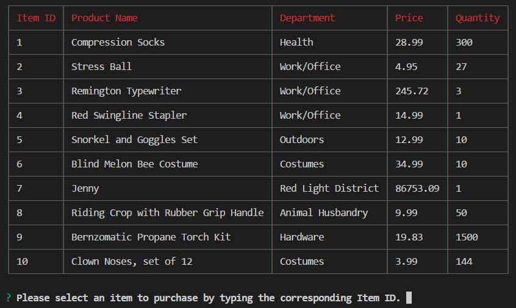
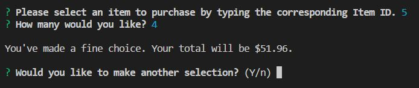
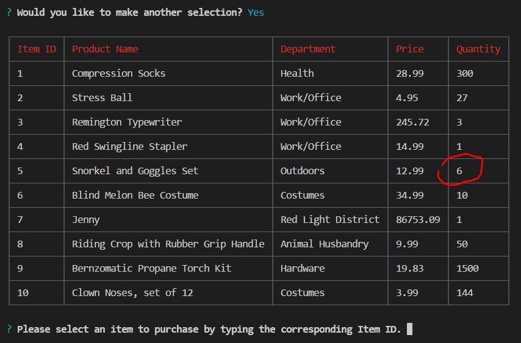
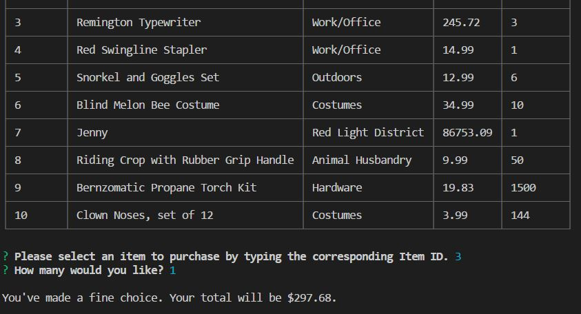
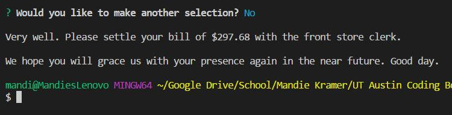
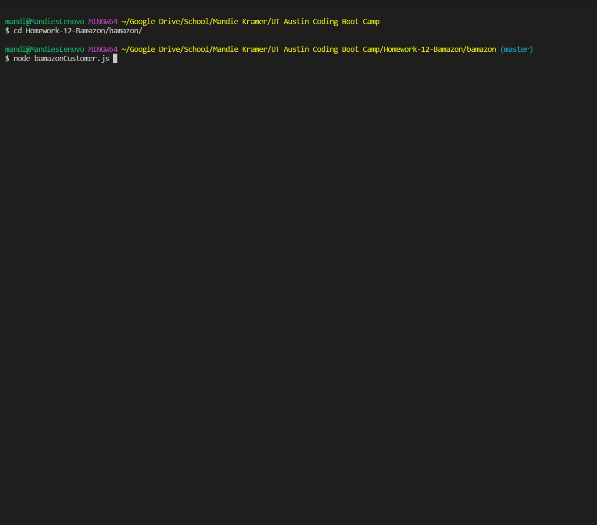

# bamazon

The goal of this homework was to build a command-line Node.js app that lets you read and manipulate a MySQL database. In this case, the app represents a store called "bamazon." 

## Installation

1. Open your terminal and change your directory to the location where you'd like to install this app.
1. Clone this repository to your own computer by typing the following into your command line:

    ````
    git clone git@github.com:ImpunityJainne/bamazon.git
    ````

1. Change your directory to enter the "bamazon" folder and install the npm requires:

    ````
    cd bamazon
    npm install
    ````

1. Update the MySQL credentials to match your own in the bamazonCustomer.js file. 

    ````
    var connection = mysql.createConnection({
      host: "localhost",
      port: 3306,
      user: "root",
      password: "root",
      database: "bamazon"
    });
    ````
    
1. Run the commands in the `bamazonSchema.sql` file in your MySQL manager (ex: MySQL Workbench or Sequel Pro) to populate the data the app will need to function.

1. Type `node bamazonCustomer.js` to begin using the app.

## Demo

1. When the app is loaded, you will see this initial screen:
    - a table of products
    - text the prompts the user to select an item for purchase.
    
    
    
1. The user is prompted to enter the ID number of the item they would like to purchase, and then the desired quantity. After entering those, the user is presented with a total and asked if they would like to make another purchase.

    

1. If the user would like to make another purchase, they select "yes." Another table with the updated inventory will be presented to them.

    

1. The user decides to make another purchase. Notice that the running total has increased.

    

1. When the user is finished making purchases, they can opt out of making another selection. The final total is presented, and the terminal exits the app.

    

Here's an animated gif of the app fully in use:


----

## About Mandie Kramer
*Check out my [**About Me**](https://impunityjainne.github.io/Bootstrap-Portfolio/) page to learn more about me!*
